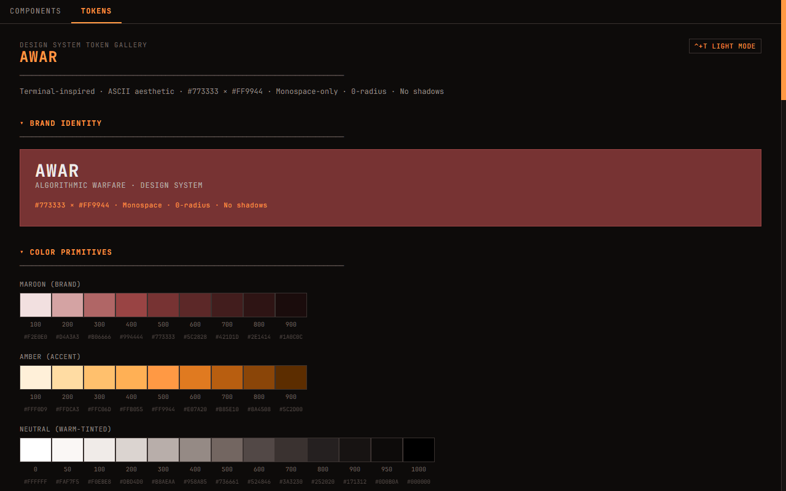
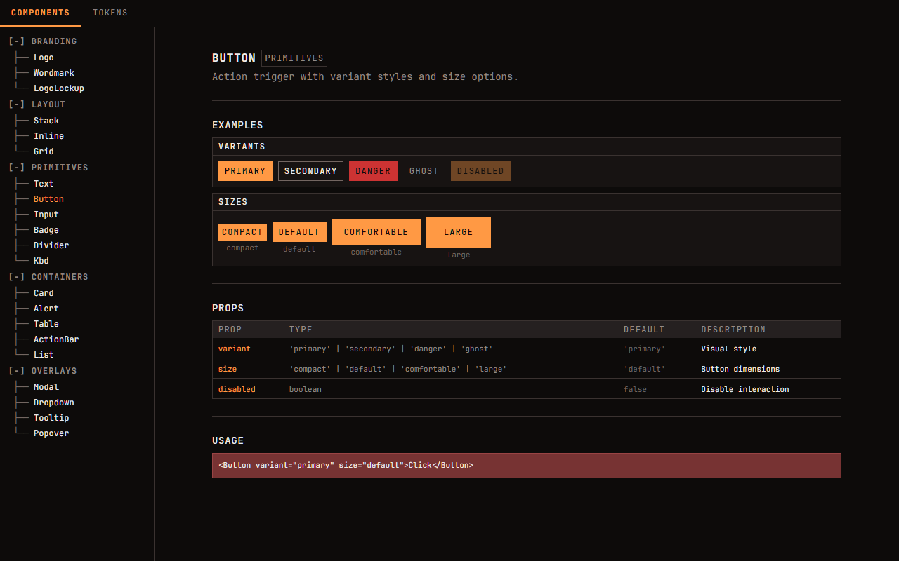
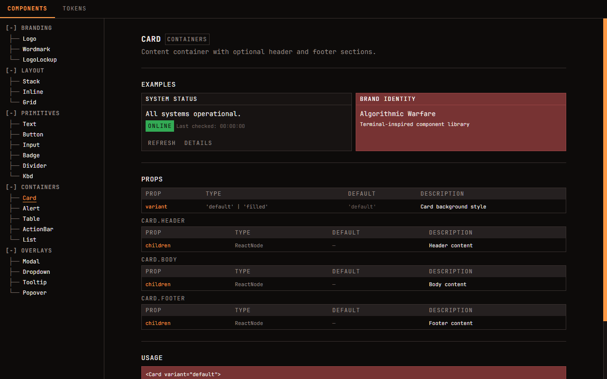

# AWAR

**Terminal-inspired React component library. Monospace everything. Zero border-radius. No shadows.**



## Design Principles

| Principle | Detail |
|-----------|--------|
| Typography | Monospace-only (JetBrains Mono) |
| Shape | Zero border-radius everywhere |
| Elevation | Tone-based — no `box-shadow` |
| Palette | Warm CRT: maroon `#773333` x amber `#FF9944` |
| Modes | Dark-first, light mode supported |
| Accents | CJK design characters 「」。 for decorative punctuation |

---

## Installation

Not yet published to npm. Install directly from GitHub:

```bash
npm install github:Algorithmic-Warfare/awar.dev-ui
```

### Peer Dependencies

```bash
npm install react react-dom \
  @radix-ui/react-dialog \
  @radix-ui/react-dropdown-menu \
  @radix-ui/react-tooltip \
  @radix-ui/react-popover
```

Works with React 18 and 19.

---

## Quick Start

```tsx
import { AWARProvider, Button, Text } from '@awar.dev/ui'
import '@awar.dev/ui/styles'

function App() {
  return (
    <AWARProvider defaultMode="dark">
      <Text role="heading">Hello, operator.</Text>
      <Button variant="primary">Execute</Button>
    </AWARProvider>
  )
}
```

---

## Components



### Primitives

| Component | Key Props |
|-----------|-----------|
| `Button` | `variant`: `primary` · `secondary` · `danger` · `ghost` / `size`: `compact` · `default` · `comfortable` · `large` |
| `Text` | `role`: `display` · `heading` · `subheading` · `body` · `label` · `caption` / `color`: `primary` · `secondary` · `brand` · `accent` ... |
| `Input` | `label` · `error` · `prefix` — extends native `<input>` |
| `Badge` | `variant`: `default` · `success` · `warning` · `error` · `info` · `brand` |
| `Divider` | `variant`: `thin` · `thick` |
| `Kbd` | `combo` (e.g. `"ctrl+s"`) · `platform`: `mac` · `win` · `auto` |

### Layout

| Component | Key Props |
|-----------|-----------|
| `Stack` | `gap`: `xs` · `sm` · `md` · `lg` · `xl` / `as` |
| `Inline` | `gap` · `wrap` · `align`: `start` · `center` · `end` · `baseline` / `as` |
| `Grid` | `columns` (number or CSS string) · `gap` / `as` |

### Containers



| Component | Key Props |
|-----------|-----------|
| `Card` | `variant`: `default` · `filled` — sub-components: `Card.Header`, `Card.Body`, `Card.Footer` |
| `Alert` | `variant`: `error` · `warning` · `success` · `info` |
| `Table` | Sub-components: `Table.Head`, `Table.Body`, `Table.Row`, `Table.Cell` (`header` prop) |
| `ActionBar` | Sub-component: `ActionBar.Item` (`disabled` prop) |
| `List` | `bullet`: `none` · `dash` · `arrow` · `dot` — sub-component: `List.Item` |

### Overlays

Built on [Radix UI](https://www.radix-ui.com/) for accessibility and keyboard navigation.

| Component | Key Props |
|-----------|-----------|
| `Modal` | `open` · `onOpenChange` — sub-components: `Modal.Trigger`, `Modal.Content` (`title`, `description`), `Modal.Close` |
| `Dropdown` | Sub-components: `Dropdown.Trigger`, `Dropdown.Content` (`align`), `Dropdown.Item` (`onSelect`), `Dropdown.Separator` |
| `Tooltip` | `content` · `side` · `sideOffset` · `delayDuration` |
| `Popover` | `open` · `onOpenChange` — sub-components: `Popover.Trigger`, `Popover.Content` (`align`, `side`), `Popover.Close` |

### Navigation

| Component | Key Props |
|-----------|-----------|
| `TreeView` | `nodes`: `TreeNode[]` · `activeKey` · `defaultCollapsed` · `renderItem` — recursive collapsible tree with indentation-only hierarchy |

### Branding

| Component | Key Props |
|-----------|-----------|
| `Logo` | `size`: `xs`–`2xl` / `variant`: `default` · `brand` · `accent` · `mono` · `inverse` |
| `Wordmark` | `size`: `xs`–`2xl` / `subtitle` |
| `LogoLockup` | `orientation`: `horizontal` · `stacked` / `size` · `variant` · `subtitle` |

---

## Hooks

**`useAWARTheme()`** — Access theme context inside `AWARProvider`. Returns `{ mode, toggle, setMode }`. Throws if used outside the provider.

**`useTheme()`** — Standalone theme management, no provider needed. Same return shape. Reads from `localStorage` / `data-mode` attribute.

**`useShortcut(combo, callback, options)`** — Register keyboard shortcuts scoped to a component subtree or globally.

```tsx
const ref = useShortcut('ctrl+s', (e) => save(), { global: false })
return <div ref={ref}>...</div>
```

Options: `global` (default `false`), `enabled` (default `true`), `preventDefault` (default `true`).

---

## Token Architecture

Three-layer CSS custom property system:

```
Primitives  --aw-ref-*    Raw values (colors, sizes, weights)
     ↓
Semantics   --aw-sys-*    Meaningful names (bg.surface, text.primary)
     ↓
Mode overrides             Color remapping via [data-mode="dark"|"light"]
```

90 primitives, 69 shared semantics, 31 dark + 31 light mode tokens.

Tokens are authored in TypeScript and compiled to CSS:

```bash
npm run generate:tokens
```

---

## Showcase

The repo includes an interactive showcase app for browsing all components and tokens.

```bash
npm run dev
```

This starts a Vite dev server at `localhost:5173` with:
- **Components tab** — browse every component with live examples, prop tables, and usage snippets
- **Tokens tab** — visual gallery of color palettes, typography scale, spacing, and elevation tokens

---

## Development

| Command | Description |
|---------|-------------|
| `npm run dev` | Start showcase dev server |
| `npm run build:lib` | Build library for distribution (`dist/`) |
| `npm run generate:tokens` | Regenerate `tokens.css` from TypeScript sources |

### Project Structure

```
src/
  components/
    branding/        Logo, Wordmark, LogoLockup
    layout/          Stack, Inline, Grid
    primitives/      Button, Text, Input, Badge, Divider, Kbd
    containers/      Card, Alert, Table, ActionBar, List
    overlays/        Modal, Dropdown, Tooltip, Popover
    navigation/      TreeView
  providers/         AWARProvider
  hooks/             useTheme, useAWARTheme, useShortcut
  tokens/            primitives.ts, semantics.ts, generate-css.ts
  showcase/          Interactive component browser
```

---

## Tech Stack

React 18/19 · TypeScript · Vite · CSS Modules · Radix UI

---

## License

Private. Copyright Algorithmic Warfare.
