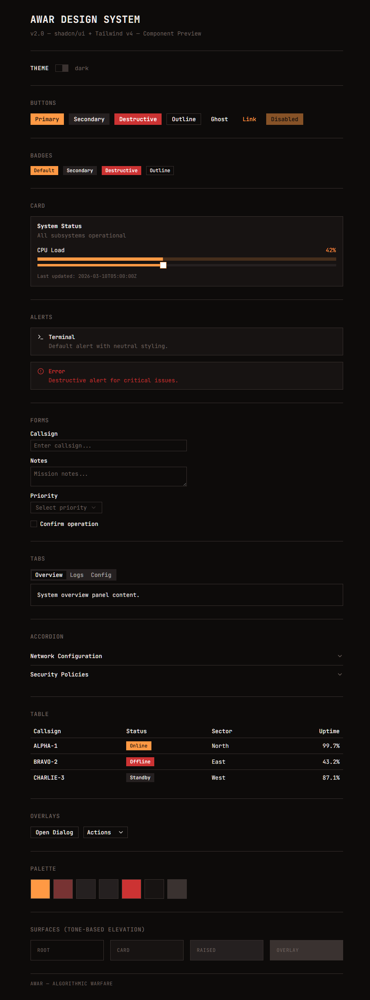
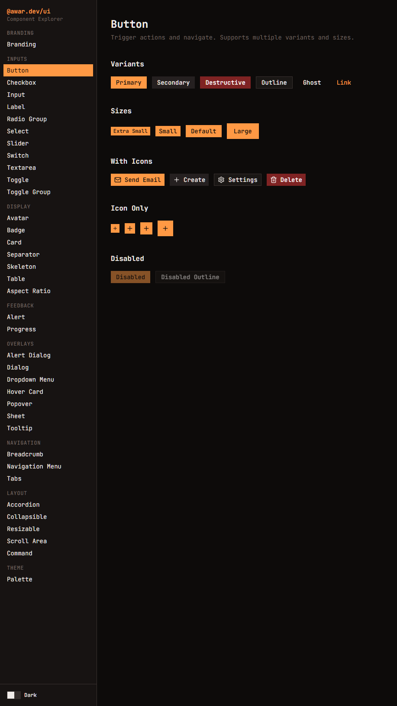
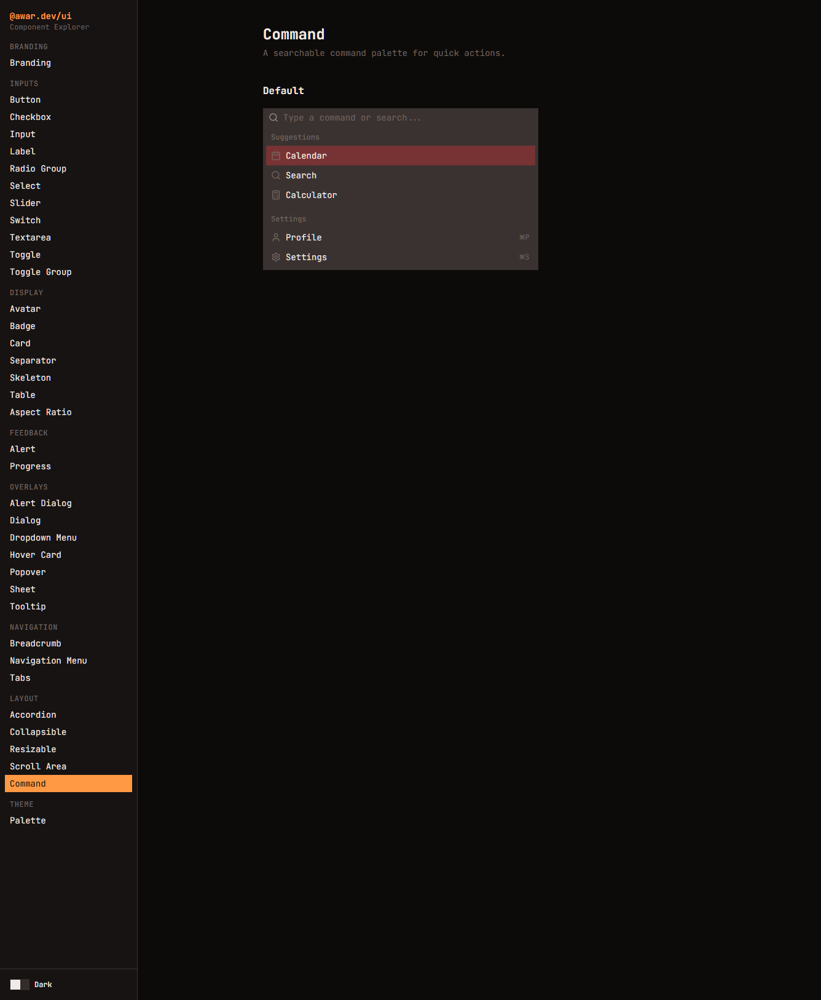
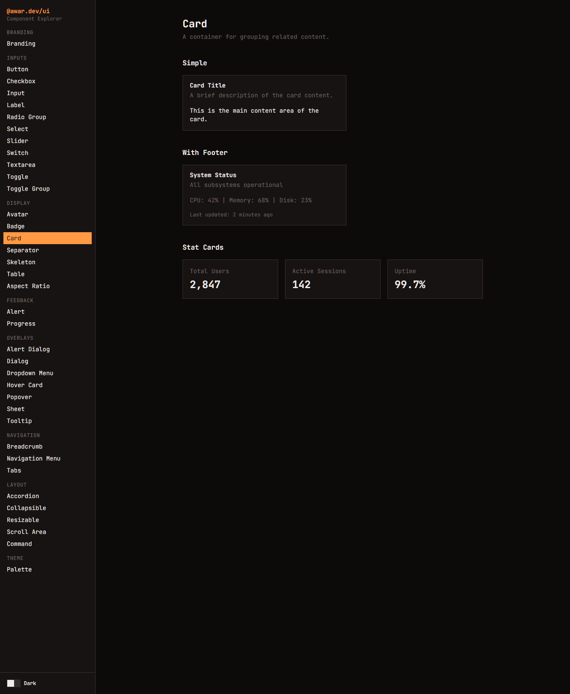
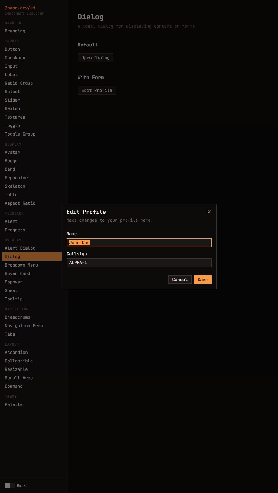
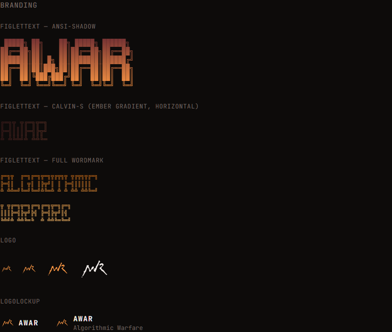
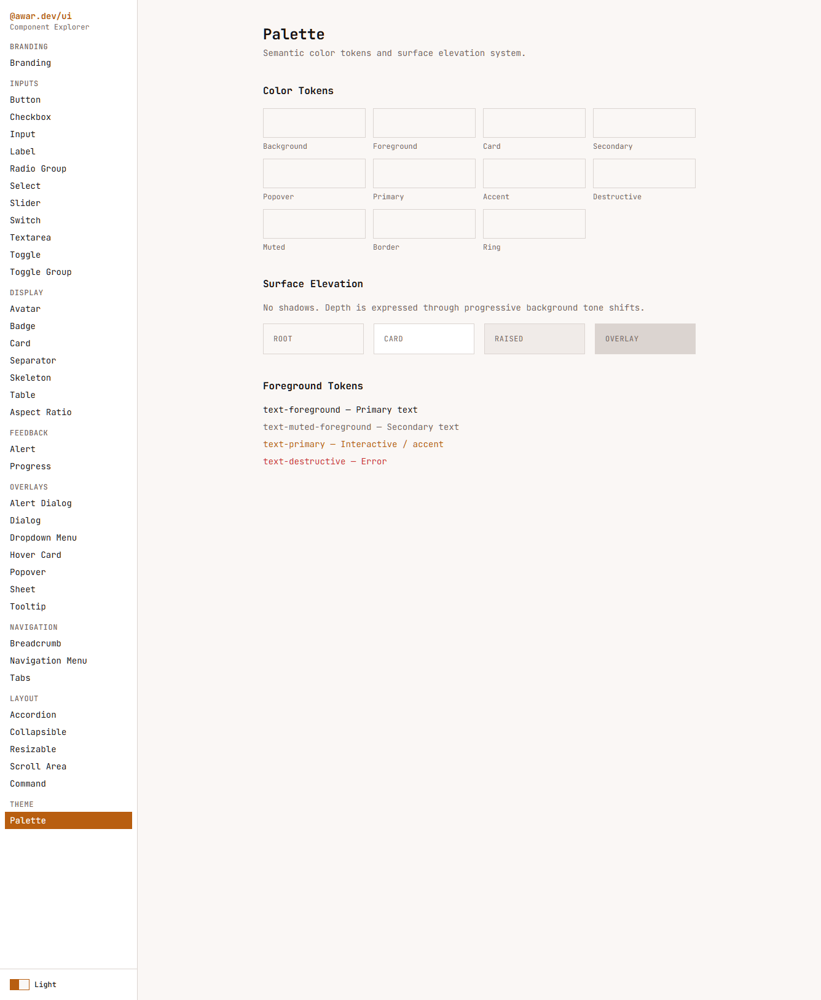

# @awar.dev/ui

**Terminal-inspired React component library built on shadcn/ui + Tailwind v4. Monospace everything. Zero border-radius. No shadows.**





## Design Principles

| Principle | Detail |
|-----------|--------|
| Typography | Monospace-only (JetBrains Mono) |
| Shape | Zero border-radius everywhere |
| Elevation | Tone-based surface shifts — no `box-shadow` |
| Density | Compact `h-7` (28px) default, 4px spacing scale |
| Palette | Warm CRT: maroon `#773333` x amber `#FF9944` x warm neutrals |
| Modes | Dark-first, light mode supported |

---

## Installation

```bash
npm install @awar.dev/ui
```

### Peer Dependencies

```bash
npm install react react-dom
```

Works with React 18 and 19.

---

## Quick Start

```tsx
import { AWARProvider, Button, Input } from '@awar.dev/ui'
import '@awar.dev/ui/styles'

function App() {
  return (
    <AWARProvider defaultTheme="dark">
      <Button>Execute</Button>
      <Input placeholder="Enter command..." />
    </AWARProvider>
  )
}
```

---

## Components

### Component Explorer

The repo includes an interactive showcase app with 40+ demo pages.

```bash
npm run dev
```



### Inputs

| Component | Description |
|-----------|-------------|
| `Button` | 6 variants (primary, secondary, destructive, outline, ghost, link) x 4 sizes |
| `Input` | Text, password, number, search with styled native controls |
| `NumberInput` | `[-] VALUE [+]` stepper with `unit` prop (SUI, $, %, ETH) |
| `Textarea` | Auto-height text area |
| `Select` | Single-value dropdown |
| `Checkbox` | Square checkbox (no rounded corners) |
| `RadioGroup` | Square radio indicators |
| `Switch` | Toggle switch |
| `Slider` | Range slider with amber thumb |
| `Toggle` / `ToggleGroup` | Pressable toggle buttons |
| `Calendar` | Date picker (single, range, popover) |
| `InputOTP` | One-time password verification input |
| `Form` | react-hook-form + zod validation integration |

### Display



| Component | Description |
|-----------|-------------|
| `Card` | Container with Header, Content, Footer sub-components |
| `Table` | Sortable columns with `TableSortHead`, auto-detect numeric sort |
| `Badge` | Status labels (default, secondary, destructive, outline) |
| `Avatar` | User avatar with image and fallback |
| `Separator` | Horizontal/vertical divider |
| `Skeleton` | Loading placeholder |
| `AspectRatio` | Constrained aspect ratio container |

### Feedback

| Component | Description |
|-----------|-------------|
| `Alert` | Informational banner with icon |
| `Progress` | Determinate progress bar |
| `Sonner` | Toast notifications |

### Overlays



| Component | Description |
|-----------|-------------|
| `Dialog` | Modal dialog with header, content, footer |
| `AlertDialog` | Confirmation dialog with cancel/action |
| `DropdownMenu` | Context menu with groups, separators, shortcuts |
| `HoverCard` | Preview card on hover |
| `Popover` | Anchored overlay panel |
| `Sheet` | Slide-in panel (top, right, bottom, left) |
| `Tooltip` | Hover tooltip |

### Navigation

| Component | Description |
|-----------|-------------|
| `Breadcrumb` | Path-based navigation with ellipsis overflow |
| `NavigationMenu` | Horizontal nav with mega-menu content |
| `Tabs` | Tab panels with underline and pill variants |

### Layout

| Component | Description |
|-----------|-------------|
| `Accordion` | Collapsible content sections |
| `Collapsible` | Single expandable region |
| `Resizable` | Draggable panel splitter |
| `ScrollArea` | Custom scrollbar container |
| `Command` | Command palette (cmdk) |

### Visualization

| Component | Description |
|-----------|-------------|
| `GraphCanvas` | React Flow wrapper with AWAR theme (pan/zoom/select) |
| `GraphEdge` | Custom bezier edge with configurable stroke/dash |
| `GraphLegend` | Legend overlay for graph node/edge types |
| `ChartContainer` | Recharts wrapper with AWAR color integration |

### Branding



| Component | Description |
|-----------|-------------|
| `FigletText` | ASCII art text with gradient support (ANSI Shadow, Calvin S) |
| `Logo` | Monogram mark at multiple sizes |
| `LogoLockup` | Logo + wordmark (horizontal, stacked) |

---

## Theme



Dark mode is the default. Light mode activates via the `.light` class on `<html>`.

```tsx
import { useAWARTheme } from '@awar.dev/ui'

function ThemeToggle() {
  const { theme, toggleTheme } = useAWARTheme()
  return <button onClick={toggleTheme}>{theme}</button>
}
```

### Surface Elevation

No shadows. Depth is expressed through background tone:

```
background → card → secondary → popover
(darkest)                      (lightest)
```

### Palette

| Token | Dark | Light | Role |
|-------|------|-------|------|
| `--background` | `#0D0B0A` | `#FAF7F5` | Root surface |
| `--card` | `#171312` | `#FFFFFF` | Card surface |
| `--primary` | `#FF9944` | `#B85E10` | Interactive / amber |
| `--accent` | `#773333` | `#773333` | Brand / maroon |
| `--destructive` | `#CC3333` | `#CC3333` | Error / red |
| `--border` | `#3A3230` | `#DBD4D0` | Borders |

---

## Development

| Command | Description |
|---------|-------------|
| `npm run dev` | Start showcase dev server |
| `npm run build:lib` | Build library (`dist/index.js` + `dist/index.css`) |
| `npm run typecheck` | TypeScript check (`tsc -b`) |

### Project Structure

```
src/
  components/
    awar/              AWAR-specific (FigletText, Logo, Graph)
    ui/                shadcn/ui components (customized)
  app/                 Dev showcase (not shipped)
  provider.tsx         AWARProvider + useAWARTheme
  index.ts             Library public API
  styles/globals.css   Theme layer + global overrides
```

---

## Tech Stack

React 19 · TypeScript · Vite · Tailwind CSS v4 · Radix UI · Recharts · React Flow

---

## License

MIT. Copyright Algorithmic Warfare.
